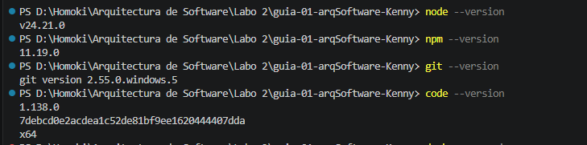
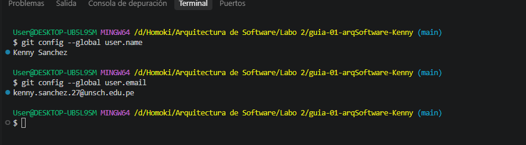

# Guía 01 - Arquitectura de Software

## Información del estudiante

**Estudiante:** Sanchez Dueñas Kenny Andree  
**Asignatura:** IS-488 - Arquitectura de Software  
**Docente:** Ing. Jaico Quispe Lizbeth
**Semestre:** 2026-II  

---

## Descripción del curso

El curso de Arquitectura de Software aborda los principios, conceptos y prácticas
necesarias para organizar y estructurar sistemas de software de manera adecuada.

Durante el curso se trabajará con decisiones arquitectónicas relacionadas con la
estructura del sistema, sus componentes, la organización del código y aspectos
como mantenibilidad, escalabilidad, seguridad y rendimiento.

Además, se utilizarán herramientas como Git, GitHub, Node.js y Visual Studio Code
para aplicar buenas prácticas de desarrollo y trabajo colaborativo.

---

## Expectativas del curso

Mis expectativas para el curso de Arquitectura de Software son fortalecer mis
conocimientos sobre el diseño y organización de sistemas de software.

Espero aprender a tomar mejores decisiones arquitectónicas, organizar proyectos
de manera profesional y aplicar buenas prácticas durante el desarrollo de
software.

También espero mejorar mis conocimientos en el uso de Git y GitHub para el
trabajo colaborativo y comprender cómo documentar las decisiones importantes
que se toman durante el desarrollo de un sistema.

Considero que estos conocimientos serán importantes para desarrollar sistemas
más organizados, mantenibles y escalables.

---

## Evidencias

### Paso 01 - Verificación del entorno de desarrollo

En este paso se verificaron las versiones de las herramientas necesarias para
el desarrollo del curso, como Node.js, npm, Git y Visual Studio Code.

---

### Paso 02 - Configuración de Git

En este paso se configuró la identidad de Git utilizando el nombre y correo
correspondientes para identificar correctamente los commits realizados durante
el desarrollo del proyecto.

---

## Herramientas utilizadas

- Node.js
- npm
- Git
- GitHub
- Visual Studio Code
- Express
- Nodemon